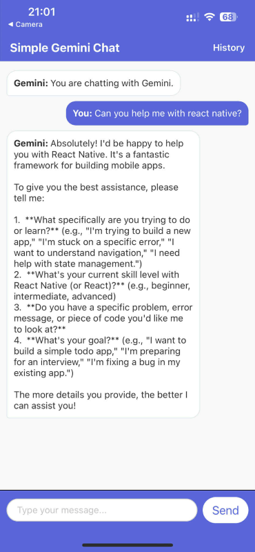

# AI Integration

A simple mobile application built with Expo and React Native that allows users to chat with an AI assistant.

The app features a live chat with Google Gemini agent, and an history page to keep track of the conversation.




## Installation

### Prerequisites

- [Node.js](https://nodejs.org/)
- [Yarn](https://yarnpkg.com/)
- [Expo Go](https://expo.dev/client) app on iOS or Android

### Steps

**Install dependecies:**

```bash
yarn install
```

**Run the project locally**

```bash
yarn start
```

Scan the QR code displayed in the terminal or browser with Expo Go to launch the app.

## Features

- **Fully Typed with TypeScript:**  
  All components, hooks, and utilities are written in strict TypeScript for improved safety and developer experience.
- **Native Navigation:**
  Smooth and performant screen transitions powered by @react-navigation/native-stack.
- **State Management:**  
  Zustand is used for managing the chat history and event state, all persisted using AsyncStorage.
- **Cross-Platform Responsive UI:**
  Polished, consistent design that works seamlessly on both Android and iOS.